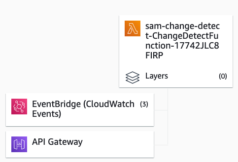

# Sam Change Detection
This is a simple serverless Python script that periodically checks websites for changes, and sends a Slack message when a change is detected. It is deployed using AWS SAM (Serverless Application Model).


EventBridge triggers the lambda that loops through all the website json snapshots in DynamoDB. It then compares the given value to a hash of the site, by checking a specific html element, or by searching for a sentence.
The json should be structured like so:
- _checktype: hash/html/search_
- _url: https://www.example.nl_
- _check_variable: unchanged_hash/check_line/sentence_

_Examples:_

- Hash:   `{"check_type": "hash",   "url": "https://www.hvdveer.nl", "unchanged_hash": "015c0f79ba863036c0b08d60f56a5601f65d326961feffd110dce526"}`
- Search: `{"check_type": "search", "url": "https://www.hvdveer.nl", "check_line": "cloud"}`
- HTML:   `{"check_type": "html",   "url": "https://www.piccardthof.nl/huisjes-te-koop/",
          "check_line": "<h6>Er zijn op dit moment geen huisjes te koop</h6>", "original_element": "h6"}`

## Structure
The project structure is based on a cookiecutter set-up for Lambda functions:
- change_detect - Code for the application's Lambda function.
- events - Invocation events that you can use to invoke the function.
- tests - Unit tests for the application code. 
- template.yaml - SAM cloudformation code that sets-up the AWS resources.

The application uses several AWS resources, including Lambda functions and an EventBridge. These resources are defined in the `template.yaml` file in this project. You can update the template to add AWS resources through the same deployment process that updates your application code. The json search strings should be added to the template.yaml.

Example:
```yaml
Resources:
  ChangeDetectFunction:
    Name: Sam-change-detector
    Type: AWS::Serverless::Function
    Properties:
      CodeUri: change_detect/
      Handler: ChangeDetect.lambda_handler
      Runtime: python3.8
      Events:
        Hvdveer5min:
          Type: Schedule
          Properties:
            Name: Hvdveer5min
            Schedule: rate(5 minutes)
            Input: '{"check_type": "hash", "url": "https://www.hvdveer.nl", "unchanged_hash": "015c0f79ba863036c0b08d60f56a5601f65d326961feffd110dce526"}'
      Environment:
        Variables:
          SLACK_WEBHOOK: webhook_secret
```      


This is what it looks like in AWS:



## Run locally

The Serverless Application Model Command Line Interface (SAM CLI) is an extension of the AWS CLI that adds functionality for building and testing Lambda applications. It uses Docker to run your functions in an Amazon Linux environment that matches Lambda. It can also emulate your application's build environment and API.

To use the SAM CLI, you need the following tools.

* SAM CLI - [Install the SAM CLI](https://docs.aws.amazon.com/serverless-application-model/latest/developerguide/serverless-sam-cli-install.html)
* [Python 3 installed](https://www.python.org/downloads/)
* Docker - [Install Docker community edition](https://hub.docker.com/search/?type=edition&offering=community)
* An AWS account

To build and test the application run the following commands

```bash
sam build 
sam local invoke "ChangeDetectFunction" -e tests/tuinwijck.json --env-vars env.json
```

The env.json contains the SLACK_WEBHOOK variable, and is not included in the repository for security reasons. Add your own webhook to test.

## Deploy
The infrastucture as code is defined in the template.yaml in SAM Cloudformation code. You can deploy like this:
```bash
sam build
sam deploy
```

## Tests

Tests are defined in the `tests` folder in this project. Use PIP to install the test dependencies and run tests.

```bash
sam-app$ pip install -r tests/requirements.txt --user
# unit test
sam-app$ python -m pytest tests/unit -v
# integration test, requiring deploying the stack first.
# Create the env variable AWS_SAM_STACK_NAME with the name of the stack we are testing
sam-app$ AWS_SAM_STACK_NAME=<stack-name> python -m pytest tests/integration -v
```

## Cleanup

To delete the sample application that you created, use the AWS CLI. Assuming you used your project name for the stack name, you can run the following:

```bash
aws cloudformation delete-stack --stack-name sam-app
```
